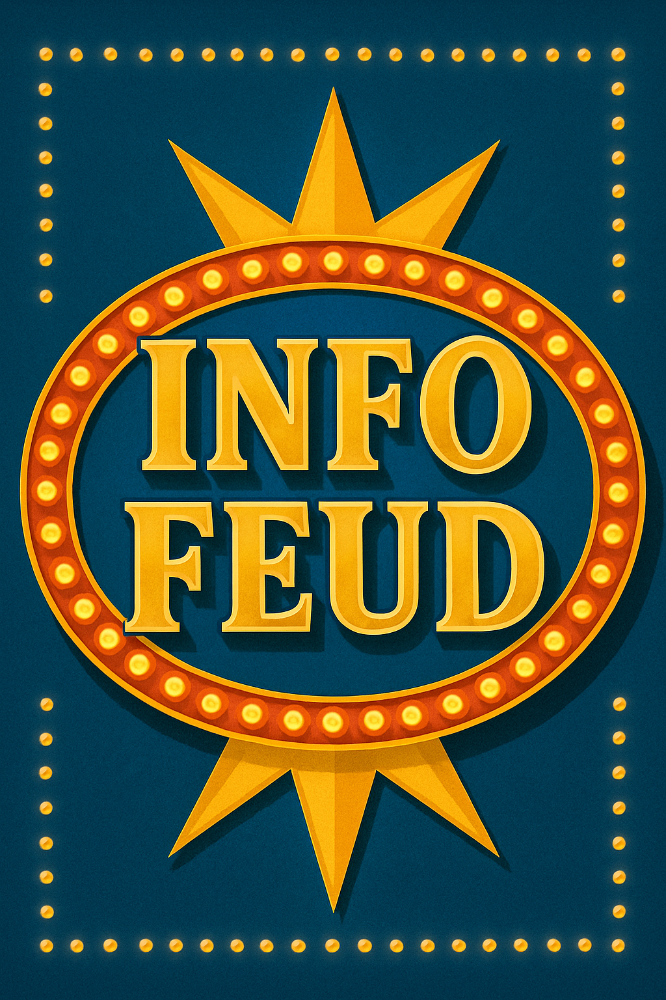
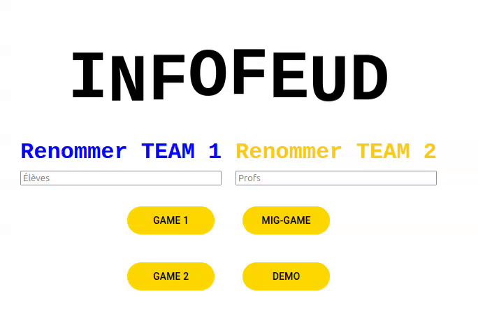
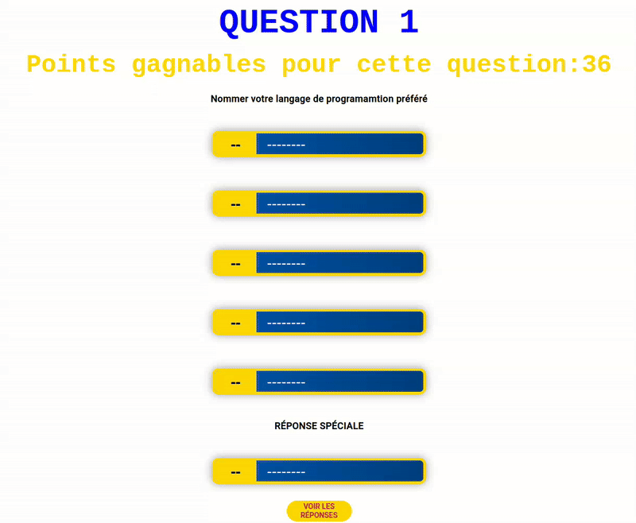
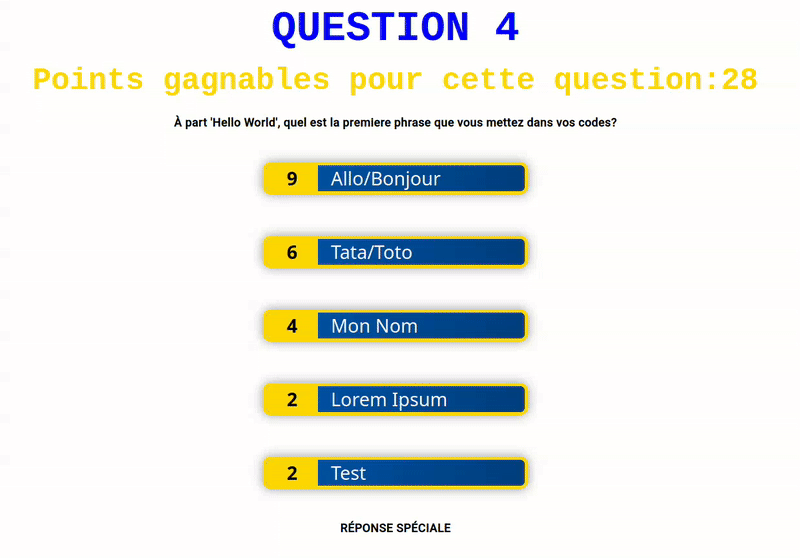

# Cégep de Shawinigan

### Documentation InfoFeud

### Travail présenté à Monsieur Nicolas Bourrée

### 420-1SH-SW

### 10 juin 2025

### Présenté par Zoé Godin

---

# Table des matières

1. [Introduction](#introduction)  
2. [Fonctionnement](#fonctionnement)  
   - [Manche normale](#manche-normale)  
   - [Manche éclair](#manche-éclair)  
3. [Développement](#développement)  
   - [Obtention des données](#obtention-des-données)  
   - [Création du logo](#création-du-logo)  
   - [Programmation et nouveaux éléments](#programmation-et-nouveaux-éléments)  
     - [Animation](#animation)  
     - [Bruitage](#bruitage)  
4. [Résultats](#résultats)  
5. [Bibliographie](#bibliographie)  
6. [Prompts utilisés](#prompts-utilisés)  
7. [Crédits](#crédits)

---

## Développement d’un jeu style `Family Feud` pour la Technique d’informatique du Cégep de Shawinigan

[README (anglais)](README.md)

### Introduction
Dans le cadre du cours de veille technologique (420-1SH-SW) du Cégep de Shawinigan, le projet suivant a pour but de développer un jeu de style télévisé (comme `La Guerre des Clans` ou `Family Feud` dans sa version américaine) pour célébrer la fin du parcours scolaire de la cohorte 2025 de la Technique d’informatique du Cégep de Shawinigan.

### Fonctionnement
Le déroulement d’InfoFeud est semblable à celui des jeux dont il s’inspire : deux équipes s’affrontent dans le but de faire le plus de points pour accéder à la manche éclair et avoir la possibilité de gagner le prix final.

#### Manche normale
L’animateur appelle une personne de chaque équipe pour venir répondre à la question. Le plus rapide a le droit de répondre et, si sa réponse donne des points, permet à son équipe de prendre la main. L’équipe a trois chances de remplir le tableau de réponses et de remporter tous les points possibles. Si elle échoue trois fois à donner des réponses valides, l’équipe adverse a le droit de se consulter pour essayer de donner une réponse figurant sur le tableau et ainsi voler les points. Si l’équipe adverse échoue également, les points vont à l’équipe initiale.

#### Manche éclair
La manche éclair met en scène deux joueurs de la même équipe qui tentent de donner les réponses les plus populaires pour remporter le prix final. Le joueur 1 se met en place, tandis que le joueur 2 doit s’isoler le temps que le premier réponde. Chaque joueur dispose de 60 secondes pour répondre à toutes les questions. Pour obtenir la victoire, les équipe doivent faire 60% de tout les points possibles.

### Développement

#### Obtention des données
Pour obtenir les données nécessaires au jeu et reproduire un environnement semblable à celui des émissions télévisées, nous avons créé un formulaire regroupant 36 questions portant sur la programmation et le métier de développeur, que nous avons envoyé aux étudiants de la Technique. S’ensuivit un travail d’une journée complète pour filtrer et attribuer des points aux réponses recueillies. Le résultat : un jeu comportant 36 questions et une centaine de réponses.

#### Création du logo
Pour donner un aspect plus officiel et soigné au projet, un prompt a été saisi sur [Sora](https://sora.chatgpt.com/explore) afin de générer un logo dans un style inspiré des jeux télévisés.



### Programmation et nouveaux éléments
Puisque le projet devait respecter les caractéristiques du cours `420-1SH-SW`, il devait inclure une technologie jamais utilisée auparavant dans la Technique. Pour créer un projet soigné incorporant des éléments déjà vus, la technologie choisie fut `Framer Motion`, une librairie permettant l’animation de composants dans Angular.


#### Animation
Avec la librairie `motion`, il est possible d'animer des composants du DOM pour délivrer un résultat plus polis et dynamique. La composante `animate` est ce que nous utilisont pour créer les movements sur ces éléments.

Il est à savoir que lorsqu'une animation est en cours, il ne peux pas avoir en avoir d'autres qui démarre puisque les éléments du DOM sont en plein changement.

Voici à quoi une composante basique d'animation ressemble:

```
animate(this.pointsTextRef.nativeElement, {
    opacity: [0, 1],
    y: [-5, 0],
    scale: [0.8, 1]
}, {
    duration: 0.5,
    ease: 'easeOut',
    delay: 0.1
});
```

Nous voyons que nous voulons animer l'élément natif de notre référence au points et que nous voulons lui changer ses propriétés de base dans la première accolade. 

Nous pouvons changer son opacité (la faire passer de 0 (donc invisible au début de l'animation) à 1 (donc visible à la fin de celle-ci)), changer sa position et induire un movement (la faire passer de -5y au début de l'animation jusqu'à sa position originale dans le DOM (0)), et pouvons aussi changer sa taille (la faire passer de 0.8 fois sa taille à son originelle). 


Dans la deuxième accolade, nous réglons les paramètre de notre animation. Nous réglons sa duré (en seconde), si il y a un délai, ainsi que le type d'animation. Le type le plus courant est le `easing` voulant dire qu'il y a un movement. Les paramètres qui peuvent être pris par le `ease` sont les différent type sont: `easeOut`, `easeIn`, `easeInOut`.

#### Bruitage
Dans le but d'ajouter une ambiance au jeu, des bruitages ont été incorporés. Ces bruitages ont surtout été incorporés en tant que "easter eggs" et font des références à beaucoup de gens de la cohorte 2025 et à des private jokes qui ont suivies au cours de l'année.


### Résultats
Le résultat du travail est un jeu qui incorpore parfaitement les capacités d'animation de la librairie `motion` avec les bruitages et le travail de la cohorte.







### Bibliographie
- Animate. Motion for JavaScript. (n.d.). https://motion.dev/docs/animate 
- Basic syntax. Markdown Guide. (n.d.). https://www.markdownguide.org/basic-syntax/ 
- Web animations for JavaScript, react and vue. Motion. (n.d.). https://motion.dev/ 

### Prompts utilisés
- Prompt pour le logo :  
    ```
    Make me a gameshow logo that is reminiscent of the oldstyle gameshows. The name of the gameshow is 'InfoFeud'. The name is separated in half, 'Info' is on top and 'feud' at the bottom
    ```

### Crédits
- **Ariane Courcy** — Aide à la création des questions | Cueillette de données | Aide aux tests | Co-animatrice  
- **Marie-Christine Bélanger** — Aide à la correction
