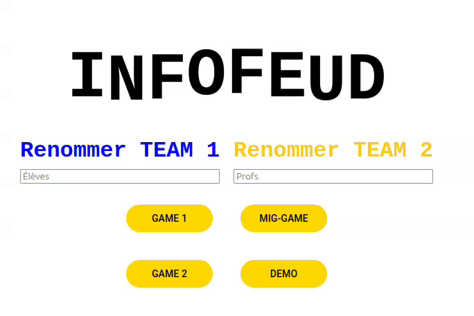
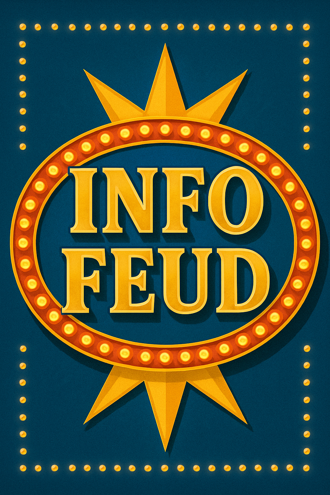

## Development of a `Family Feud`-Style Game for the Computer Science Program at Cégep de Shawinigan



[README (French)](README.fr.md)

### Introduction  
As part of the Tech Watch course (420-1SH-SW) at Cégep de Shawinigan, the following project was designed to create a game in the style of classic TV game shows (like *La Guerre des Clans* or the American version *Family Feud*) to celebrate the graduation of the 2025 cohort of the Computer Science program.

### How It Works  
The structure of *InfoFeud* closely mirrors that of the shows it was inspired by: two teams compete to score the most points in order to reach the lightning round and win the final prize.

#### Regular Round  
The host calls one player from each team to answer a question. The fastest responder earns the right to answer first. If their answer scores points, their team gains control. The team then has three chances to fill the answer board and collect all possible points. If they fail three times, the opposing team can discuss and attempt to give a correct answer to steal the points. If they also fail, the original team keeps the points.

#### Lightning Round  
The lightning round features two players from the same team trying to give the most popular answers to a series of questions to win the final prize. Player 1 answers first while Player 2 is isolated. Each player has 60 seconds to answer all questions. To win, the players needs to gain 60% of all possible points.

### Development

#### Data Collection  
To gather the necessary data and replicate a TV-style experience, we created a survey containing 36 questions related to programming and the developer profession. This survey was distributed to students in the program. A full day of work followed to sort and assign points to the collected responses. The result: a game with 36 questions and over a hundred valid answers.

#### Logo Creation  
To give the project a more polished and professional look, we used a prompt on [Sora](https://sora.chatgpt.com/explore) to generate a logo in the style of classic TV game shows.



### Programming and New Features  
Since the project had to incorporate a technology not previously used in the program, we chose to use `Framer Motion`, a library that enables component animation in Angular. This allowed us to create a sleek project while also integrating familiar tools and skills.

### Results  
The final result is a game that effectively combines the animation features of the `motion` library with sound effects and creative work contributed by the cohort.

### Bibliography
- Animate. Motion for JavaScript. (n.d.). https://motion.dev/docs/animate  
- Basic Syntax. Markdown Guide. (n.d.). https://www.markdownguide.org/basic-syntax/  
- Web Animations for JavaScript, React and Vue. Motion. (n.d.). https://motion.dev/  

### Prompts Used
- Prompt for the logo:  
    ```
    Make me a gameshow logo that is reminiscent of the oldstyle gameshows. The name of the gameshow is 'InfoFeud'. The name is separated in half, 'Info' is on top and 'feud' at the bottom
    ```

### Credits
- **Ariane Courcy** — Helped create the questions | Data collection | Testing | Co-host  
- **Marie-Christine Bélanger** — Proofreading assistance
